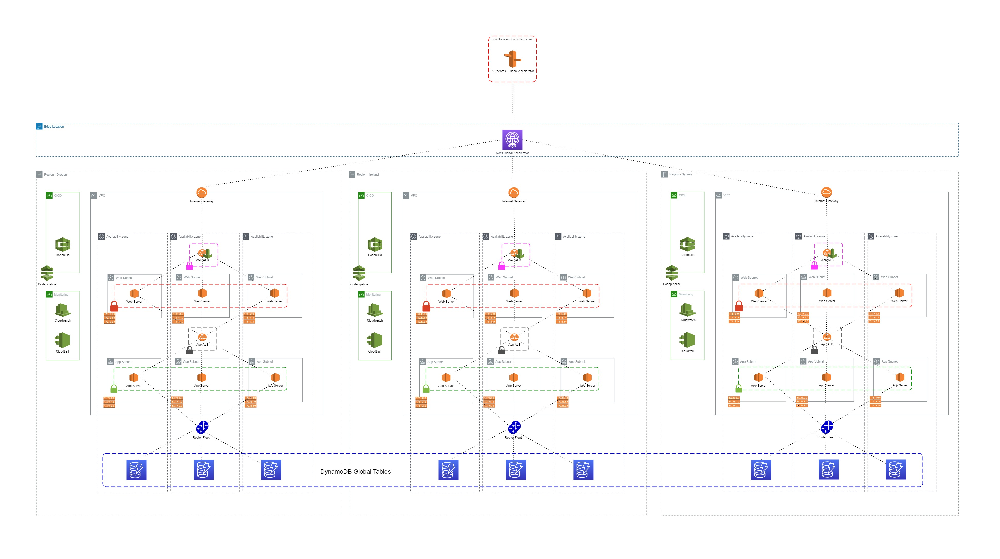
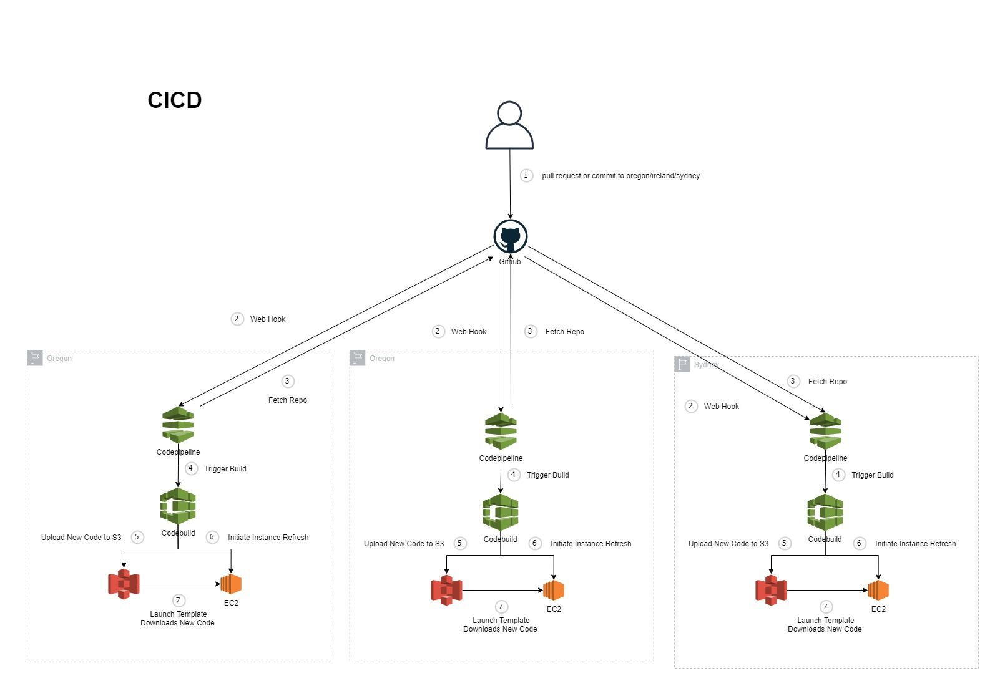

# Introduction 


• [Website](https://www.bcx.co.za/exa/) • [Docs](docs/architecture/architecture.svg)

## Quick Summary

This code is to showcase how one could implement a traditional 3-Tier App across 3 continents using the Serverless Framework - Open Source and AWS.


## Dummy Use-Case

BCX Exa Medical wanted a highly available application that services their first responders and ER doctors across the globe.  The main aim is for doctors and first responders to access a patients medical history in life or death situations as well as give doctors across the world access to the same information should one doctor contact another for help.  


## Objective

- 99.999% Availability (5.26 minutes DOWMTIME per year)
- Low Latency For Users in US, EU and AUS
- Cross-Continent Eventual Consistency (Under 3 Seconds)
- Blue/Green Deployment Capabilities
- Canary Deployment Capabilities
- One Deployment Command

# Architecture

A general idea of the resources used in this solution.



## CICD

A view of how the CICD pipeline works for this solution.


---
# Quick Start - Local Environment Setup

---
## Pre-requisites
---
1. Make sure you have Nodejs installed
2. Make sure you have AWS CLI installed
3. You need to have a domain registered in Route53, change the domain name in the environments folder to match your domain.

### Initial Setup
---

1.  Install Global Packages

```bash
npm install -g serverless && npm install -g cross-env
```

2. Install Local Packages

```bash
npm install
```

3. Setup your aws profile

```bash
aws configure --profile bcxexa
```

4. Create and configure your local env files inside your environments folder.

Filenames
- .env.local

```bash
GITHUB_OWNER=<GITHUB OWNER>
GITHUB_REPO=<YOUR REPO>
GITHUB_TOKEN=<GITHUB TOKEN>
AWS_ACCESS_KEY_ID=<YOUR KEY>
AWS_SECRET_ACCESS_KEY=<YOUR KEY>
```

---
# One Command Deployment
---


1. You can now deploy the demo using this command

```bash
npm run deploy
```

---
### Destroying environments
---
1. You can now destroy the demo using this command
```bash
npm run destroy
```

### Reading Material

- Cloudfront Multi-Region - https://aws.amazon.com/blogs/apn/using-amazon-cloudfront-with-multi-region-amazon-s3-origins/
- Architectural Patterns for Multi-Region Active Active - https://www.youtube.com/watch?v=2e29I3dA8o4
- Find ALB hosted zone id's - https://docs.aws.amazon.com/general/latest/gr/elb.html
- User Data Scripts & Lifecycle Hooks - https://medium.com/faun/autoscaling-like-a-pro-how-to-use-ec2-auto-scaling-lifecycle-hooks-the-right-way-7e1e6c952d3c
- DynamoDB Table Design Pattern - Versioning - https://aws.amazon.com/blogs/database/implementing-version-control-using-amazon-dynamodb/

# Version

- 0.0.1

# Contributions

- BCX Exa Core Team

# Special Mentions

- Serverless Framework
- AWS